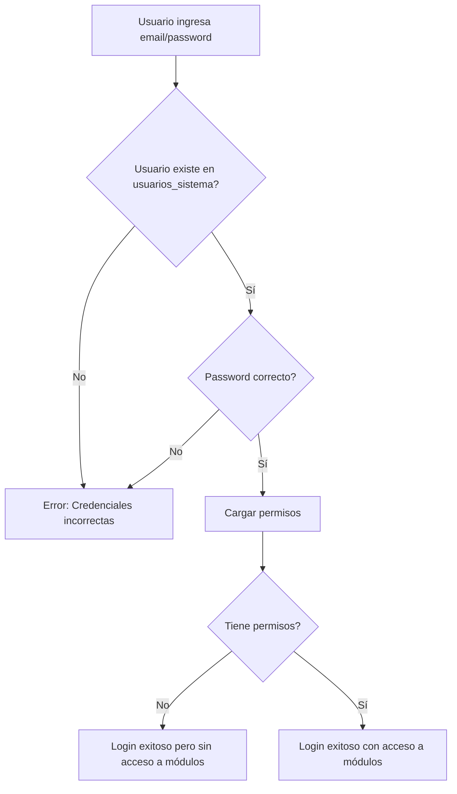

# 🎯 Resumen Completo de Cambios

## 📋 Problema Original

```
❌ Error 406 (Not Acceptable) en login
❌ Usuarios legacy sin permisos (undefined)
❌ Password en texto plano en URL (inseguro)
❌ No hay usuarios en usuarios_sistema
```

---

## ✅ Soluciones Implementadas

### 1. **Corrección del Error 406**

**Antes (❌):**
```javascript
.eq('password', password) // Password en URL - ERROR 406
```

**Ahora (✅):**
```javascript
// Obtener usuario sin password en query
.eq('email', email)
.maybeSingle();

// Verificar password en el cliente
if (usuario.password === password) {
  // Login exitoso
}
```

### 2. **Eliminación de Usuarios Legacy**

**App.jsx:**
- ✅ Sesiones legacy se limpian automáticamente
- ✅ Solo `tipo: 'sistema'` permitido
- ✅ Verificación estricta en cada carga

**Login.jsx:**
- ✅ Solo busca en `usuarios_sistema`
- ✅ No hay fallback a usuarios legacy
- ✅ Error claro si no es usuario del sistema

### 3. **Sistema de Permisos Estricto**

**Antes (❌):**
```javascript
// Bypass temporal - acceso completo
return true;
```

**Ahora (✅):**
```javascript
// Verificación estricta
if (!user.permisos || user.permisos.length === 0) {
  return false;
}
const permiso = user.permisos.find(p => p.modulos?.codigo === codigoModulo);
return permiso?.[accion] || false;
```

---

## 📁 Archivos Modificados

### Código Principal
- ✅ `App.jsx` - Eliminado soporte legacy, permisos estrictos
- ✅ `src/components/Login.jsx` - Corregido error 406, sin legacy

### Scripts de Utilidad
- ✅ `diagnostico_permisos.js` - Verificar permisos de usuarios
- ✅ `listar_usuarios_sistema.js` - Listar todos los usuarios
- ✅ `crear_usuario_admin.sql` - Crear usuario administrador
- ✅ `limpiar_usuarios_legacy.sql` - Limpiar usuarios legacy

### Documentación
- ✅ `ELIMINACION_USUARIOS_LEGACY.md` - Detalles técnicos
- ✅ `INSTRUCCIONES_CREAR_USUARIOS.md` - Guía paso a paso
- ✅ `RESUMEN_CAMBIOS_COMPLETO.md` - Este archivo

---

## 🚀 Cómo Usar el Sistema Ahora

### Paso 1: Crear Usuario Administrador
```bash
# Ejecutar en Supabase SQL Editor
# Ver: crear_usuario_admin.sql
```

### Paso 2: Verificar Usuario Creado
```bash
node listar_usuarios_sistema.js
```

### Paso 3: Probar Login
```
Email: admin@agroverde.com
Password: 12345678
```

### Paso 4: Verificar Permisos
```bash
node diagnostico_permisos.js
```

---

## 🔒 Mejoras de Seguridad

| Aspecto | Antes | Ahora |
|---------|-------|-------|
| Password en URL | ❌ Sí (inseguro) | ✅ No (seguro) |
| Usuarios legacy | ❌ Permitidos | ✅ Bloqueados |
| Verificación de sesión | ❌ Solo localStorage | ✅ BD en cada carga |
| Permisos | ❌ Bypass temporal | ✅ Verificación estricta |
| Error handling | ❌ Genérico | ✅ Específico y claro |

---

## 📊 Flujo de Login Actual



---

## 🎯 Comportamiento por Tipo de Usuario

### Usuario con Permisos Completos
```javascript
{
  tipo: 'sistema',
  email: 'admin@agroverde.com',
  permisos: [
    { modulos: { codigo: 'pesadas' }, puede_ver: true, ... },
    { modulos: { codigo: 'facturas_factoria' }, puede_ver: true, ... },
    // ... más permisos
  ]
}
```
✅ Puede acceder a todos los módulos con permisos

### Usuario sin Permisos
```javascript
{
  tipo: 'sistema',
  email: 'usuario@agroverde.com',
  permisos: []
}
```
⚠️ Solo puede ver "Servidor" y "Base de Datos"

### Usuario Legacy (Ya no soportado)
```javascript
{
  tipo: 'legacy',
  // ...
}
```
❌ Sesión se limpia automáticamente

---

## 🐛 Errores Corregidos

1. ✅ **Error 406** - Password ya no va en URL
2. ✅ **Permisos undefined** - Usuarios legacy bloqueados
3. ✅ **Bypass de seguridad** - Permisos verificados estrictamente
4. ✅ **Sesiones inválidas** - Se limpian automáticamente

---

## 📝 Logs del Sistema

### Login Exitoso
```
🔐 Intentando login con: admin@agroverde.com
📊 Resultado usuarios_sistema: { id: '...', email: '...' }
✅ Contraseña correcta para: admin@agroverde.com
✅ Usuario del sistema encontrado: admin@agroverde.com
✅ Permisos cargados: 24 módulos
✅ Login exitoso - Guardando sesión...
```

### Login Fallido
```
🔐 Intentando login con: usuario@ejemplo.com
📊 Resultado usuarios_sistema: null
❌ Usuario no encontrado en usuarios_sistema: usuario@ejemplo.com
❌ Credenciales incorrectas para: usuario@ejemplo.com
```

### Sesión Legacy Detectada
```
⚠️ Tipo de usuario inválido: legacy
🧹 Limpiando sesión inválida...
```

---

## 🔧 Mantenimiento

### Crear Nuevo Usuario
```sql
-- Ver: crear_usuario_admin.sql
-- Modificar email, password y rol según necesites
```

### Asignar Permisos
```sql
INSERT INTO permisos_usuario (usuario_id, modulo_id, puede_ver, puede_crear, puede_editar, puede_eliminar)
VALUES ('[usuario_id]', '[modulo_id]', true, true, true, true);
```

### Desactivar Usuario
```sql
UPDATE usuarios_sistema
SET activo = false
WHERE email = 'usuario@ejemplo.com';
```

### Limpiar Usuarios Legacy
```sql
-- Ver: limpiar_usuarios_legacy.sql
```

---

## 🎓 Conceptos Clave

### Tipos de Usuario
- **Sistema**: Usuario en `usuarios_sistema` con permisos configurados
- **Legacy**: Usuario antiguo (YA NO SOPORTADO)

### Permisos
- `puede_ver`: Ver el módulo
- `puede_crear`: Crear registros
- `puede_editar`: Editar registros
- `puede_eliminar`: Eliminar registros

### Módulos Especiales
- **Servidor**: Siempre visible
- **Base de Datos**: Siempre visible
- **Otros**: Requieren permisos explícitos

---

## 📞 Soporte

Si encuentras problemas:

1. ✅ Ejecuta `node listar_usuarios_sistema.js`
2. ✅ Ejecuta `node diagnostico_permisos.js`
3. ✅ Revisa los logs en la consola del navegador
4. ✅ Verifica la tabla `usuarios_sistema` en Supabase
5. ✅ Verifica la tabla `permisos_usuario` en Supabase

---

## ✨ Resultado Final

- 🔒 Sistema más seguro
- 🧹 Código más limpio
- ✅ Permisos estrictos
- 🚫 Sin usuarios legacy
- 📊 Logs claros y útiles
- 📝 Documentación completa
